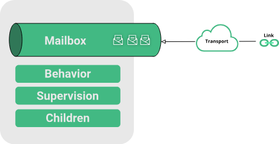

# MLambda Actors
MLambda Actors is one of the implementations of the actor models for 
**DotNet Core** and **Kotlin** technology.

There are many implementations of the actor model as 
[AKKA.net](https://getakka.net/), [Orleans](https://dotnet.github.io/orleans) and [Proto Actor](http://proto.actor).
All of these implementations are hard to understand and don't provide a clean architecture.
Our vision is to create a simple, lightweight library for computing the actor models, designing it
using Solid Principles.

>Note: as Hexagonal architecture define: Restful, gRPC, WebSockets are ports and don't define an architecture. 
>We want to provide the more simple concept to understand actors, and do not compromise the
>design with a specific port, for us the actors are the Application layer on DDD.

See the [architecture](site/architecture.md)

The mission of this framework is to provide a base to define **Hexagonal Architecture**.

In the development of the microservices, there are many paradigms about how it is implemented,
we know that a Microservice has the own database, and the code should be small allow to
refactor the code in at least two weeks

These are some pragmatical criteria, but there is not a unification theory about microservices, but
for my perspective the close architecture that can help us to define a precise microservices,
based on *agile* methodology and clean architectures as Hexagonal Architecture.

> Note: Alistair Cockburn define the Hexagonal Architecture [About it](https://alistair.cockburn.us/hexagonal-architecture/)

Some design principles that can help us to govern the structure is Domain Driven Design.

The principles are:

1. There is a bounded context, it is a bunch of entities aggregations.
2. There are entities and value objects, Entities has a unique identity, the value objects are
types that don't have an identity, it is based in the internal state.
3. The Domain core doesn't have any access to persistence.
4. Persisting the state using the repository pattern.

 

To provide a solid Microservices architecture, the actor model is going to handle the applications layer,
Using actor allows to design a resilient, robustness, persisted handles message. An actor model
has a mailbox and for some exceptions, the actor
use supervision that helps to recover for failure scenarios. 

To define a Microservices Architecture some patterns should be provided as:
[Microservices Patterns](https://microservices.io/patterns/microservices.html)

- Data
    - Database Per service. 
- Communication:
    - Api Gateway
    - Messaging 
    - Remote invocation
- Discovery
    - Client-Side Discovery
    - Server-Side Discovery
    - Circuit Breaker
- Observability 
    - Health Check API
    - Distribute tracing

Now we are going to define how actors can help to achieve these patterns:

**Database Per service**: Defining DDD we are going to provide Context Bounded, that means that every context bounded
has to have her database and her container.

**Api Gateway** It is not important due Kubernetes handle this part with the Ingress.

**Messaging** Actor model is designed to decoupling the message for the process, that means every actor use
a persisted resilience mailbox, it not necessary to use a streaming-broker technology as [Kafka](https://kafka.apache.org/) or
[Rabbit MQ](https://www.rabbitmq.com/)  or other messaging systems. 

> Note: If you are using this kind of technology, it is probably that you have implemented an actor model.

**Remote invocation** The actor model allow you can define a remote address to communicate to the
actors.

**Client-Side Discovery** it is handled by Kubernetes.

**Server-Side Discovery** it is handled by Kubernetes.

**Circuit Breaker** it is handled by Kubernetes.

**Health Check API** it is handled by Kubernetes.

**Distribute tracing** it is handled by the actors, the actors is going to handle that monitoring, this
a framework is using [Jaeger](https://www.jaegertracing.io/)

This kind of architectures is compromised with the [reactive manifest](https://www.reactivemanifesto.org/)